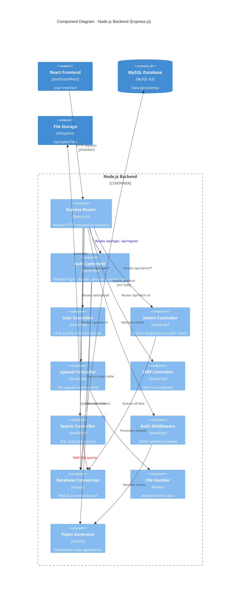

# C4 Model - Component Diagram

## Component Level - Node.js Backend

This diagram shows the internal components of the Node.js Backend container.



## Component Responsibilities

### Router Layer

#### Express Router
- Main HTTP request router
- Maps URLs to controller handlers
- No input validation layer

### Controllers

#### Auth Controller (`/api/login`, `/api/register`)
- **Vulnerabilities:** 
  - A02: Plain text password storage
  - A03: Parameter tampering (role injection)
  - A07: Predictable session tokens
  - A03: SQL injection (`/api/legacy-login`)

#### User Controller (`/api/user/*`)
- **Vulnerabilities:**
  - A01: IDOR - No authorization checks
  - Access any user's profile by ID
  - Access sensitive data of any user

#### Admin Controller (`/api/admin/*`)
- **Vulnerabilities:**
  - A01: No role-based access control
  - Any authenticated user can access
  - Returns all user data

#### Upload Controller (`/api/upload`)
- **Vulnerabilities:**
  - A08: No file type validation
  - No file size limits
  - No content scanning
  - Files publicly accessible

#### SSRF Controller (`/api/fetch-url`)
- **Vulnerabilities:**
  - A10: No URL validation
  - Can access internal resources
  - Can read local files
  - No allowlist

#### Search Controller (`/api/search`)
- **Vulnerabilities:**
  - A03: SQL injection via raw query
  - No prepared statements
  - No input sanitization

### Services

#### Auth Middleware
- Validates JWT tokens (weak implementation)
- Does NOT check authorization (only authentication)
- Used by protected routes

#### Token Generator
- **Vulnerability:** Predictable token generation
- Base64 encoded `userId-secret-timestamp`
- Weak secret key
- No proper JWT library usage

#### Database Connection
- MySQL2 connection pool
- Used by all controllers
- **Vulnerability:** Some queries use string concatenation

#### File Handler (Multer)
- Handles multipart/form-data
- **Vulnerability:** No file type restrictions
- Saves with original filename

## Data Flow Patterns

### Authentication Flow
```
User → Router → Auth Controller → Token Generator → DB Connection → MySQL
                                         ↓
                                    Predictable Token
                                         ↓
                                    User (stored in localStorage)
```

### IDOR Flow
```
Attacker → Router → Auth Middleware → User Controller → DB Connection → MySQL
                         ↓                   ↓
                   Valid Token?        No ID check!
                   (YES, any user)         ↓
                                      Return ANY user's data
```

### SQL Injection Flow
```
Attacker → Router → Search Controller → DB Connection → MySQL
                            ↓
                    Raw SQL concatenation
                            ↓
                    `SELECT * FROM users WHERE username LIKE '%${query}%'`
                            ↓
                    Injection: query = "' UNION SELECT * FROM users-- "
```

## Vulnerability Distribution

| Component | Vulnerabilities | Severity |
|-----------|----------------|----------|
| Auth Controller | A02, A03, A07, SQL Injection | Critical |
| User Controller | A01 (IDOR) | High |
| Admin Controller | A01 (No AuthZ) | High |
| Upload Controller | A08 (Unrestricted Upload) | Critical |
| SSRF Controller | A10 (SSRF) | High |
| Search Controller | A03 (SQL Injection) | Critical |
| Token Generator | A07 (Weak Tokens) | High |
| Auth Middleware | A01 (No AuthZ check) | High |

