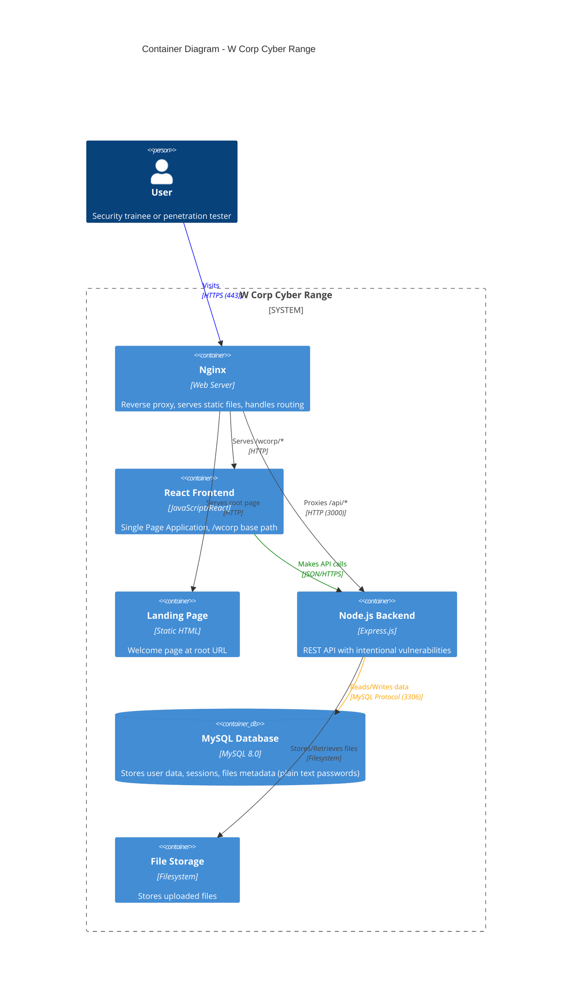

# C4 Model - Container Diagram

## Container Level

This diagram shows the high-level technology containers (applications, data stores) that make up the W Corp Cyber Range system.

## Container Responsibilities

### Nginx (Reverse Proxy)
- Entry point for all HTTP/HTTPS traffic
- Routes `/` → Landing page
- Routes `/wcorp/*` → React SPA
- Proxies `/api/*` → Node.js backend
- Serves static assets

### React Frontend (/wcorp)
- Single Page Application
- User authentication UI
- User portal and admin portal
- File upload interface
- Demonstrates client-side vulnerabilities (XSS, CSRF)

### Landing Page (/)
- Static HTML welcome page
- Explains the cyber range purpose
- Links to training environment

### Node.js Backend (Express.js)
- REST API endpoints (`/api/*`)
- Authentication logic (weak/predictable)
- Database queries (includes SQL injection vulns)
- File upload handling (unrestricted)
- SSRF endpoint
- Contains ALL server-side vulnerabilities

### MySQL Database
- Stores user accounts (plain text passwords!)
- Session management
- File metadata
- Sensitive user data (SSNs, credit cards)
- Internal notes

### File Storage
- Uploaded files directory
- No file type restrictions
- Publicly accessible

## Technology Stack

| Container | Technology | Port |
|-----------|-----------|------|
| Nginx | nginx:latest | 80, 443 |
| React Frontend | React 18.2, React Router 6 | - |
| Node Backend | Node.js 16, Express.js | 3000 |
| MySQL | MySQL 8.0 | 3306 |
| File Storage | Local filesystem | - |

## Security Characteristics

- ⚠️ All containers run in Docker
- ⚠️ Backend has NO input validation
- ⚠️ Database stores plain text passwords
- ⚠️ File upload has NO restrictions
- ⚠️ No rate limiting
- ⚠️ Predictable session tokens
- ⚠️ Environment files exposed

