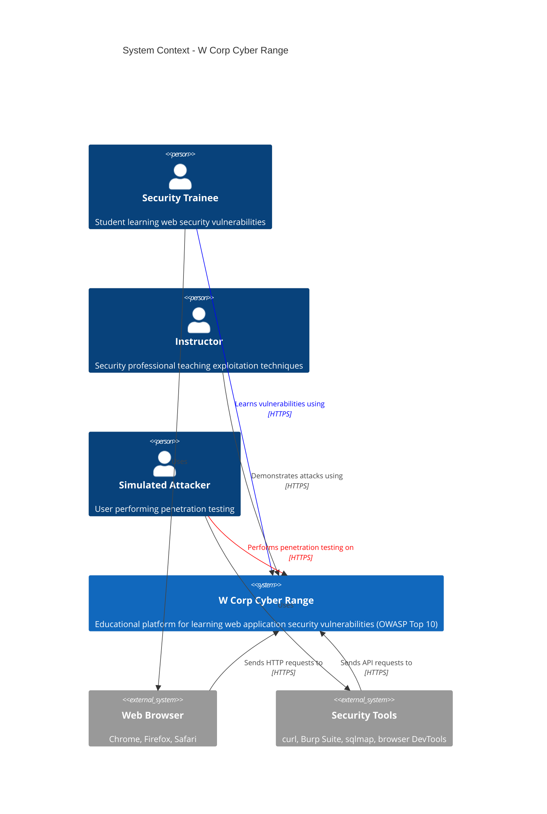

# C4 Model - Context Diagram

## System Context Level

This diagram shows the W Corp Cyber Range system and how it interacts with users and external systems.

[C4 Context](./static/C4%20context.png)

## Key Interactions

- **Trainees** access the platform to learn about security vulnerabilities in a safe environment
- **Instructors** use it to demonstrate exploitation techniques
- **Simulated Attackers** practice penetration testing skills
- **Security Tools** are used to exploit intentional vulnerabilities
- All interactions happen over **HTTPS** to the deployed instance

## External Dependencies

- Web browsers for UI interaction
- Command-line tools (curl) for API testing
- Security tools (Burp Suite, sqlmap) for advanced exploitation
- Browser DevTools for client-side attacks

