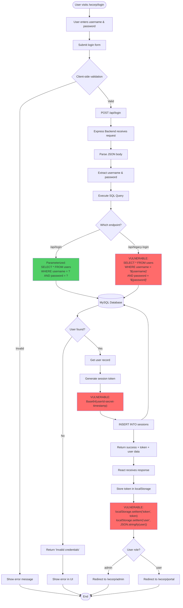
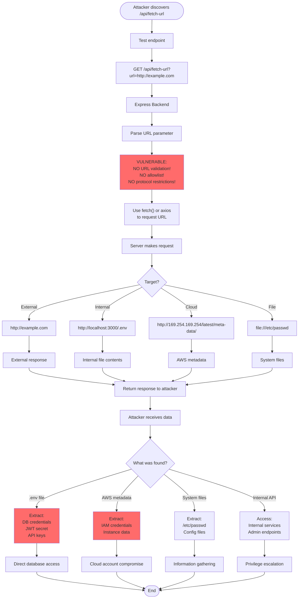

# Data Flow Diagrams

## 1. User Authentication Flow

[User Auth Flow](./static/user%20auth%20flow.png)

## 2. IDOR Attack Data Flow

[IDOR Attack Flow](./static/IDOR%20attack%20flow.png)

```mermaid
flowchart TD
    Start([Attacker logged in as User ID 5]) --> ViewProfile[Navigate to /wcorp/portal/profile/5]
    ViewProfile --> ReactLoad[React loads UserProfile component]
    ReactLoad --> ExtractID[Extract ID from URL params]
    
    ExtractID --> APICall[GET /api/user/profile/5]
    APICall --> AddHeader[Add Authorization: Bearer token]
    AddHeader --> SendReq[Send HTTP request]
    
    SendReq --> Backend[Express Backend]
    Backend --> AuthMW[Auth Middleware]
    AuthMW --> ValidateToken{Token valid?}
    
    ValidateToken -->|No| Return401[Return 401 Unauthorized]
    ValidateToken -->|Yes| ExtractUser[Extract userId from token]
    
    ExtractUser --> Controller[User Controller]
    Controller --> GetIDParam[Get ID from URL parameter]
    GetIDParam --> VulnCheck["VULNERABLE:<br/>No authorization check!<br/>Doesn't verify userId === ID"]
    
    VulnCheck --> SQLQuery["Query:<br/>SELECT * FROM users WHERE id = ?"]
    SQLQuery --> DB[(MySQL Database)]
    DB --> ReturnData[Return user data]
    
    ReturnData --> SendResponse[Send response to attacker]
    SendResponse --> ReactDisplay[React displays data]
    
    ReactDisplay --> AttackerSees[Attacker sees User 5's data]
    
    AttackerSees --> ChangeURL[Attacker changes URL to /wcorp/portal/profile/1]
    ChangeURL --> Exploit["EXPLOITATION:<br/>Same flow repeats"]
    Exploit --> GetAdmin["Attacker receives<br/>Admin's profile data!"]
    
    GetAdmin --> Enumerate[Attacker enumerates IDs 1-100]
    Enumerate --> StealAll[Steals all user data]
    
    Return401 --> End([End])
    StealAll --> End
    
    style VulnCheck fill:#ff6b6b
    style Exploit fill:#ff6b6b
    style GetAdmin fill:#ff6b6b
```

## 3. SQL Injection Attack Data Flow

[SQL Injection Attack Flow](./static/SQL%20injection.png)

```mermaid
flowchart TD
    Start([Attacker has Burp Suite/curl]) --> Craft[Craft SQL injection payload]
    Craft --> Payload["Payload:<br/>username = admin'-- <br/>password = anything"]
    
    Payload --> SendReq[POST /api/legacy-login]
    SendReq --> Backend[Express Backend]
    Backend --> Parse[Parse JSON body]
    Parse --> Extract[Extract username & password]
    
    Extract --> VulnCode["VULNERABLE CODE:<br/>const sql = `SELECT * FROM users<br/>WHERE username = '${username}'<br/>AND password = '${password}'`"]
    
    VulnCode --> Concat[String concatenation]
    Concat --> FinalQuery["Final SQL:<br/>SELECT * FROM users<br/>WHERE username = 'admin'-- '<br/>AND password = 'anything'"]
    
    FinalQuery --> Comment["Comment (--) removes<br/>password check!"]
    Comment --> Execute[Execute SQL on MySQL]
    Execute --> DB[(MySQL Database)]
    
    DB --> Results[Query returns admin user]
    Results --> GenToken[Generate token for admin]
    GenToken --> ReturnSuccess[Return success + admin token]
    
    ReturnSuccess --> AttackerReceives[Attacker receives admin token]
    AttackerReceives --> StoreToken[Attacker stores token]
    StoreToken --> UseToken[Use token for authenticated requests]
    
    UseToken --> AdminAccess[Full admin access achieved!]
    
    AdminAccess --> AdvancedExploit{Advanced exploitation?}
    AdvancedExploit -->|Yes| UnionAttack[UNION SELECT attack]
    UnionAttack --> ExtractData["POST /api/search<br/>query = ' UNION SELECT * FROM users-- "]
    ExtractData --> AllPasswords[Extract all passwords]
    
    AdvancedExploit -->|No| End([End])
    AllPasswords --> End
    
    style VulnCode fill:#ff6b6b
    style FinalQuery fill:#ff6b6b
    style Comment fill:#ff6b6b
    style AdminAccess fill:#ff6b6b
```

## 4. File Upload Attack Data Flow

[File Upload Attack](./static/File%20upload%20attack.png)

```mermaid
flowchart TD
    Start([Attacker logged in]) --> CreateFile[Create malicious file]
    CreateFile --> FileType{File type?}
    
    FileType -->|HTML| HTMLFile["malicious.html<br/><script>steal cookies</script>"]
    FileType -->|SVG| SVGFile["xss.svg<br/><script>XSS payload</script>"]
    FileType -->|Shell| ShellFile["shell.php<br/><?php system($_GET['cmd']); ?>"]
    
    HTMLFile --> SelectFile[Select file in UI]
    SVGFile --> SelectFile
    ShellFile --> SelectFile
    
    SelectFile --> SubmitForm[Submit upload form]
    SubmitForm --> ReactSend[React sends POST /api/upload]
    ReactSend --> MultipartData[multipart/form-data]
    
    MultipartData --> Backend[Express Backend]
    Backend --> AuthMW[Auth Middleware]
    AuthMW --> CheckToken{Token valid?}
    
    CheckToken -->|No| Return401[Return 401]
    CheckToken -->|Yes| Multer[Multer middleware]
    
    Multer --> VulnValidation["VULNERABLE:<br/>NO file type validation!<br/>NO size limit!<br/>NO content scanning!"]
    
    VulnValidation --> SaveFile[Save to /uploads directory]
    SaveFile --> UseOriginal["Use original filename<br/>(or minor modification)"]
    UseOriginal --> Filesystem[(Filesystem)]
    
    Filesystem --> SaveDB[Save metadata to files table]
    SaveDB --> DB[(MySQL Database)]
    DB --> ReturnSuccess[Return success + file URL]
    
    ReturnSuccess --> AttackerGets[Attacker receives file URL]
    AttackerGets --> FileURL["URL: /uploads/malicious.html"]
    
    FileURL --> ShareLink[Attacker shares link with victim]
    ShareLink --> VictimClick[Victim clicks link]
    VictimClick --> BrowserLoad[Browser loads file]
    
    BrowserLoad --> Execute{File type?}
    Execute -->|HTML/SVG| RunJS[JavaScript executes]
    Execute -->|PHP| PHPExec["If PHP enabled:<br/>Shell access!"]
    
    RunJS --> StealCookie[Steal victim's cookies/tokens]
    PHPExec --> RemoteCode[Remote code execution]
    
    StealCookie --> Compromise[Account compromise]
    RemoteCode --> ServerTakeover[Server takeover]
    
    Return401 --> End([End])
    Compromise --> End
    ServerTakeover --> End
    
    style VulnValidation fill:#ff6b6b
    style RunJS fill:#ff6b6b
    style PHPExec fill:#ff6b6b
```

## 5. SSRF Attack Data Flow

[SSRF Attack Flow](./static/SSRF%20attack%20flow.png)

## 6. Complete Attack Chain Data Flow

[Kill Chain Flow](./static/kill%20chain.png)

```mermaid
flowchart TD
    Start([Reconnaissance]) --> Discover[Discover application]
    Discover --> EnumEndpoints[Enumerate endpoints]
    
    EnumEndpoints --> FindEnv["Find /.env exposed<br/>(A05: Security Misconfiguration)"]
    FindEnv --> ExtractCreds["Extract:<br/>DB credentials<br/>JWT secret"]
    
    ExtractCreds --> SQLi["SQL Injection attack<br/>(A03: Injection)"]
    SQLi --> BypassAuth["Bypass authentication<br/>admin'-- "]
    BypassAuth --> GetAdminToken[Obtain admin token]
    
    GetAdminToken --> IDOR["IDOR attack<br/>(A01: Broken Access Control)"]
    IDOR --> EnumUsers[Enumerate all users]
    EnumUsers --> StealData[Steal sensitive data]
    
    StealData --> FileUpload["File upload attack<br/>(A08: Data Integrity Failures)"]
    FileUpload --> UploadShell[Upload web shell]
    UploadShell --> RCE[Remote code execution]
    
    RCE --> SSRF["SSRF attack<br/>(A10: SSRF)"]
    SSRF --> InternalAccess[Access internal resources]
    InternalAccess --> CloudMeta[Access cloud metadata]
    
    CloudMeta --> Persistence[Establish persistence]
    Persistence --> Backdoor[Install backdoor]
    Backdoor --> CompleteCompromise[Complete system compromise]
    
    CompleteCompromise --> End([Attack Complete])
    
    style FindEnv fill:#ff6b6b
    style BypassAuth fill:#ff6b6b
    style EnumUsers fill:#ff6b6b
    style UploadShell fill:#ff6b6b
    style CloudMeta fill:#ff6b6b
    style CompleteCompromise fill:#c92a2a
```

## Summary

These data flow diagrams illustrate:

1. **Authentication Flow**: Shows both secure and vulnerable authentication paths
2. **IDOR Attack**: Demonstrates how lack of authorization enables data theft
3. **SQL Injection**: Shows string concatenation leading to authentication bypass
4. **File Upload**: Illustrates unrestricted upload to XSS/RCE
5. **SSRF**: Shows how URL validation absence enables internal access
6. **Complete Chain**: Demonstrates how vulnerabilities can be chained

### Key Vulnerability Patterns

| Pattern | Vulnerability | Impact |
|---------|---------------|--------|
| No input validation | SQL Injection, XSS | Critical |
| No authorization checks | IDOR, Admin access | High |
| Weak cryptography | Predictable tokens | High |
| No file restrictions | RCE, XSS | Critical |
| No URL validation | SSRF, Data exposure | High |
| Client-side storage | Token theft | High |

